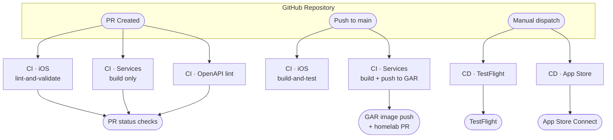

# CI/CD Workflows Documentation

This document describes the CI/CD workflows configured for the Cove project — iOS app deployment to TestFlight and App Store, backend service builds and image pushes to Google Artifact Registry (GAR), and OpenAPI spec linting.

## Architecture



## Overview

The Cove project uses GitHub Actions for continuous integration and deployment:

- **Manual TestFlight deployments** via workflow dispatch
- **Manual App Store submissions** via workflow dispatch
- **Automated iOS quality checks** on pull requests (linting only)
- **Automated iOS build and test** on main branch pushes
- **Automated backend service builds** on path-filtered PRs and main pushes
- **Auto-incrementing build numbers** for each iOS deployment
- **Manual marketing version bumps** only when releasing to App Store

## Workflows

### 1. CI - iOS (`ci-ios.yml`)

**Triggers:**
- Pull requests touching `apps/ios/**` (excluding `*.md`)
- Pushes to `main` touching `apps/ios/**` (excluding `*.md`)

**Purpose:** Quality gate on PRs; build + test validation after merge to main

Two jobs run depending on the event — only one fires per run:

#### `lint-and-validate` (pull requests only)

**Steps:**
- ✅ Detect whether any Swift files changed (skips lint steps if none changed)
- ✅ Run SwiftFormat in lint-only mode (when Swift files changed)
- ✅ Run SwiftLint with `--strict` (when Swift files changed)
- ✅ Check for merge conflict markers (when Swift files changed)
- ✅ Validate `Info.plist` format (always runs)

**Configuration:**
- Runs on macOS-26
- No build or test execution (fast feedback)
- No code signing required

#### `build-and-test` (pushes to main only)

**Steps:**
- ✅ Build the iOS app using Fastlane
- ✅ Run unit tests (continues on error)

**Configuration:**
- Runs on macOS-26
- Uses Ruby 4.0.1 with bundler cache
- Uses Swift Package Manager (resolved automatically by xcodebuild)
- Runs `bundle exec fastlane build` and `bundle exec fastlane test`

**Note:** Tests continue on error to allow viewing all test results even if some fail.

### 2. CD - Deploy to TestFlight (`cd-testflight.yml`)

**Trigger:** Manual workflow dispatch with optional reason input

**Purpose:** Deploy to TestFlight for beta testing

**Steps:**
1. Checkout code with full git history
2. Set up Ruby 4.0.1 with bundler cache
3. Configure git for version commits
4. Import code signing certificates
5. Download provisioning profiles
6. Set up App Store Connect API key
7. **Run `fastlane beta` lane** which:
   - Auto-increments build number (syncs with TestFlight)
   - Builds and archives the app (SPM packages resolved by xcodebuild)
   - Uploads to TestFlight
   - Commits and pushes version bump
8. Get version and build info from Info.plist
9. Check for duplicate release tags
10. Create GitHub Release with prerelease flag
11. Upload build artifacts on failure

**Versioning:**
- `CFBundleVersion` (Build Number): **Auto-incremented** (1, 2, 3, 4...)
- Build number syncs with latest TestFlight build to avoid conflicts
- `CFBundleShortVersionString` (Marketing Version): **Unchanged** (stays at current version)

**Required Secrets:** All 8 secrets (see Required Secrets section below)

### 4. CD - Release to App Store (`cd-appstore.yml`)

**Trigger:** Manual workflow dispatch

**Purpose:** Submit a new version to App Store Connect

**Steps:**
1. Checkout code with full git history
2. Set up Ruby 4.0.1 with bundler cache
3. Configure git for version commits
4. Import code signing certificates
5. Download provisioning profiles
6. Set up App Store Connect API key
7. **Run `fastlane release version:X.Y.Z` lane** which:
   - Updates marketing version to specified version
   - Auto-increments build number (syncs with TestFlight)
   - Builds and archives the app (SPM packages resolved by xcodebuild)
   - Submits to App Store Connect
   - Commits and pushes version bump
8. Update GitHub release notes with build information (or create new release)
9. Upload build artifacts on failure

**Versioning:**
- `CFBundleShortVersionString`: **Derived from legacy tag parsing logic** (non-functional with manual trigger)
- `CFBundleVersion`: **Auto-incremented** and synced with TestFlight

**Usage:**
To release to App Store, manually trigger the workflow from GitHub Actions UI.

**Note:** The workflow includes legacy logic to parse version from git tags (from when it was triggered by tag pushes), but this code is non-functional with the current manual trigger setup. The version cannot currently be specified when manually triggering the workflow.

**Required Secrets:** All 8 secrets (see Required Secrets section below)

### 5. CI - Services (`ci-services.yml`)

**Triggers:**
- Pull requests touching `services/cove-api/**`, `services/cove-image/**`, `services/cove-item/**`, `services/cove-user/**`, or `packages/imgproxy/**`
- Pushes to `main` touching those paths
- Manual `workflow_dispatch` (useful for bootstrapping GAR before an integration branch merges)

**Concurrency:** Cancels in-progress runs for the same workflow + ref on new pushes.

**Jobs:** Five jobs run in parallel — one per service (`cove-api`, `cove-image`, `cove-item`, `cove-user`) plus one for the shared `packages/imgproxy` module.

**What each service job does (`cove-api`, `cove-image`, `cove-item`, `cove-user`):**

1. Set up Go (version from `go.mod`)
2. Run `go test ./...` and `go vet ./...`
3. **On main / `workflow_dispatch` only:** Authenticate to GCP via Workload Identity Federation, configure Docker, build and push image to Google Artifact Registry (GAR) as `sha-<full-commit-sha>`
4. **On PRs:** Build only (no push) — verifies the Dockerfile and that the service compiles

**`packages/imgproxy` job:** Runs `go test ./...` and `go vet ./...` on the shared imgproxy signing library. No Docker build or GAR push — `packages/imgproxy` is a Go module included in the build context of `cove-image` and `cove-item`, not a deployed service.

After all five jobs succeed on main or `workflow_dispatch`, a sixth job (`bump-overlay-tags`) opens a PR against `danicajiao/homelab` that bumps the Kustomize overlay image tags to the new SHA. On main it updates both staging and prod overlays; on other branches (e.g. integration branch `workflow_dispatch`) it updates staging only.

**Required variables (not secrets):** `WIF_PROVIDER`, `WIF_SERVICE_ACCOUNT` — see [Backend Infrastructure](BACKEND_INFRASTRUCTURE.md) for the one-time GCP setup.

**Required secrets:** `HOMELAB_PAT` — GitHub PAT with write access to `danicajiao/homelab` (used by `bump-overlay-tags` to push and open the homelab PR).

---

### 6. CI - OpenAPI Lint (`ci-openapi.yml`)

**Trigger:** Pull requests touching `services/cove-api/api/**`, `services/cove-image/api/**`, `services/cove-item/api/**`, or `services/cove-user/api/**`

**Purpose:** Lint all OpenAPI specs for validity and style using [Redocly CLI](https://redocly.com/docs/cli/).

**Steps:**
1. Install `@redocly/cli` (latest)
2. Lint `services/cove-api/api/openapi.yaml` using `services/cove-api/redocly.yaml`
3. Lint `services/cove-image/api/openapi.yaml` using `services/cove-image/redocly.yaml`

This workflow runs on PRs only — there is no main-push gate for spec linting. As Phase 3 services (`cove-item`, `cove-user`) gain OpenAPI specs, add their paths to this workflow's path filter and add lint steps.

---

## Required Secrets

**Total: 9 secrets (8 required, 1 unused)**

The following secrets must be configured in your GitHub repository settings:

### Code Signing
- `CERTIFICATES_P12`: Base64-encoded .p12 certificate file
- `CERTIFICATES_PASSWORD`: Password for the .p12 certificate
- `PROVISIONING_PROFILE`: Base64-encoded provisioning profile
- `PROVISIONING_PROFILE_SPECIFIER`: Name of the provisioning profile

### App Store Connect API
- `APP_STORE_CONNECT_API_KEY_ID`: API Key ID from App Store Connect
- `APP_STORE_CONNECT_API_ISSUER_ID`: Issuer ID from App Store Connect
- `APP_STORE_CONNECT_API_KEY`: Base64-encoded API Key (.p8 file)

### GitHub
- `GH_PAT`: GitHub Personal Access Token with repo permissions (used by iOS CD workflows for pushing version bump commits)
- `HOMELAB_PAT`: GitHub Personal Access Token with write access to `danicajiao/homelab` (used by `ci-services.yml` `bump-overlay-tags` job to push branches and open PRs in the homelab repo)

### GCP (services CI only)
These are **variables** (not secrets) — non-sensitive identifiers stored under GitHub → Settings → Secrets and variables → Actions → **Variables** tab:
- `WIF_PROVIDER`: Workload Identity Federation pool/provider path for GCP auth
- `WIF_SERVICE_ACCOUNT`: Service account email that CI impersonates to push images to Google Artifact Registry (GAR)

**Note:** The `APPLE_TEAM_ID` secret mentioned in earlier documentation is not currently used by the workflows.

## Versioning Strategy

### Build Number (`CFBundleVersion`)
- **Purpose:** Unique identifier for each build
- **Format:** Integer (1, 2, 3, 4...)
- **Management:** Auto-incremented by CI/CD on every deployment
- **Usage:** Used for TestFlight builds and App Store submissions

### Marketing Version (`CFBundleShortVersionString`)
- **Purpose:** User-facing version number
- **Format:** Semantic versioning (1.0.0, 1.1.0, 2.0.0)
- **Management:** Manually updated only when creating a release
- **Usage:** Displayed to users in App Store and Settings

### Version Flow Example

1. **Development Phase:**
   - Marketing Version: `1.0.0`
   - Multiple feature developments
   - When ready for beta testing, manually trigger TestFlight deployment
   - Build number increments with each deployment: 1, 2, 3, 4...
   - Each build deploys to TestFlight with version `1.0.0 (1)`, `1.0.0 (2)`, etc.

2. **Release Phase:**
   - Manually trigger App Store release workflow
   - Specify new marketing version (e.g., `1.1.0`)
   - Marketing Version updated to `1.1.0`
   - Build number continues incrementing (e.g., 5)
   - Submits to App Store as version `1.1.0 (5)`

3. **Post-Release:**
   - Marketing Version stays at `1.1.0`
   - Continue development
   - Manually trigger TestFlight deployments as needed
   - Build numbers keep incrementing: 6, 7, 8...
   - TestFlight receives `1.1.0 (6)`, `1.1.0 (7)`, etc.

## Setup Instructions

### 1. Configure Secrets

Add all required secrets to your GitHub repository:
1. Go to Settings → Secrets and variables → Actions
2. Click "New repository secret"
3. Add each secret listed above

### 2. Set up Code Signing

```bash
# Export certificate to .p12
# In Keychain Access:
# 1. Select your distribution certificate
# 2. File → Export Items
# 3. Save as .p12 with a password

# Base64 encode the certificate
base64 -i YourCertificate.p12 -o certificateb64.txt
# Copy contents of certificateb64.txt to CERTIFICATES_P12 secret

# Base64 encode the provisioning profile
base64 -i YourProfile.mobileprovision -o profileb64.txt
# Copy contents of profileb64.txt to PROVISIONING_PROFILE secret
```

### 3. Create App Store Connect API Key

1. Go to [App Store Connect](https://appstoreconnect.apple.com/)
2. Users and Access → Keys
3. Generate a new API key with App Manager role
4. Download the .p8 file
5. Note the Key ID and Issuer ID
6. Base64 encode the .p8 file and add to secrets

### 4. Install Fastlane (Local Development)

```bash
# Install Ruby dependencies
bundle install

# Run Fastlane lanes locally
bundle exec fastlane build    # Build for testing
bundle exec fastlane test     # Run tests
bundle exec fastlane beta     # Deploy to TestFlight
bundle exec fastlane release  # Deploy to App Store
```

SPM packages are resolved automatically by xcodebuild — no separate dependency install step is needed.

## Tools Used

- **GitHub Actions**: CI/CD orchestration
- **Fastlane**: iOS automation (building, signing, deploying)
- **Swift Package Manager**: Dependency management (built into Xcode)
- **xcodebuild**: Building and archiving iOS apps
- **TestFlight**: Beta testing platform
- **App Store Connect**: App distribution and management
- **Ruby**: 4.0.1 (for Fastlane runtime)
- **macOS Runner**: macOS-26 (GitHub Actions runner)

## Local Development

All commands below must be run from `apps/ios/`:

```bash
cd apps/ios
```

### Building the App
Using Fastlane (recommended):
```bash
bundle exec fastlane build
```

Using xcodebuild directly:
```bash
xcodebuild build \
  -project Cove.xcodeproj \
  -scheme Cove \
  -sdk iphonesimulator
```

### Running Tests
Using Fastlane (recommended):
```bash
bundle exec fastlane test
```

Using xcodebuild directly:
```bash
xcodebuild test \
  -project Cove.xcodeproj \
  -scheme Cove \
  -destination 'platform=iOS Simulator,name=iPhone 17 Pro'
```

### Deploying with Fastlane
```bash
# Deploy to TestFlight (requires all secrets to be configured)
bundle exec fastlane beta

# Submit to App Store (specify version)
bundle exec fastlane release version:1.1.0
```

**Note:** Local deployments require proper configuration of environment variables and code signing certificates. It's recommended to use the GitHub Actions workflows for deployments.

## Troubleshooting

### Build Fails with Code Signing Error
- Verify all code signing secrets are correctly configured
- Check that provisioning profile matches the bundle identifier
- Ensure certificates haven't expired

### TestFlight Upload Fails
- Verify App Store Connect API credentials
- Check that the bundle identifier matches your App Store Connect app
- Ensure you have proper permissions in App Store Connect

### Build Number Already Exists
- TestFlight requires unique build numbers
- The auto-increment script should prevent this
- If it occurs, manually increment the build number

### SPM Package Resolution Fails
- In Xcode: **File → Packages → Resolve Package Versions**
- If that fails: **File → Packages → Reset Package Caches** (re-downloads all packages)
- On CI: clearing `~/Library/Caches/org.swift.swiftpm` and `DerivedData` forces a full re-resolution

## Best Practices

1. **Never commit sensitive data**: Certificates, keys, and profiles should only be in GitHub Secrets
2. **Use pull requests**: All code should go through PR review and linting checks
3. **Manual deployments**: TestFlight and App Store deployments are manually triggered for better control
4. **Test on main**: Main branch automatically builds and tests to catch integration issues early
5. **Test before releasing**: Use TestFlight builds for thorough testing before App Store submission
6. **Follow semantic versioning**: Major.Minor.Patch (e.g., 1.2.3)
7. **Document changes**: Include clear release notes in GitHub releases created by TestFlight workflow
8. **Monitor build numbers**: Ensure they increment correctly to avoid conflicts

## References

- [Fastlane Documentation](https://docs.fastlane.tools/)
- [GitHub Actions Documentation](https://docs.github.com/en/actions)
- [Apple Developer Portal](https://developer.apple.com/)
- [App Store Connect](https://appstoreconnect.apple.com/)
- [Swift Package Manager](https://www.swift.org/documentation/package-manager/)
